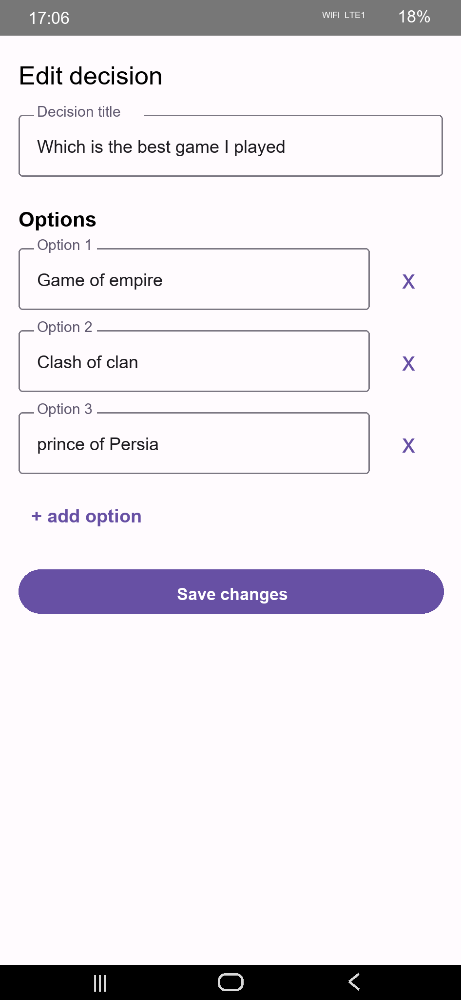
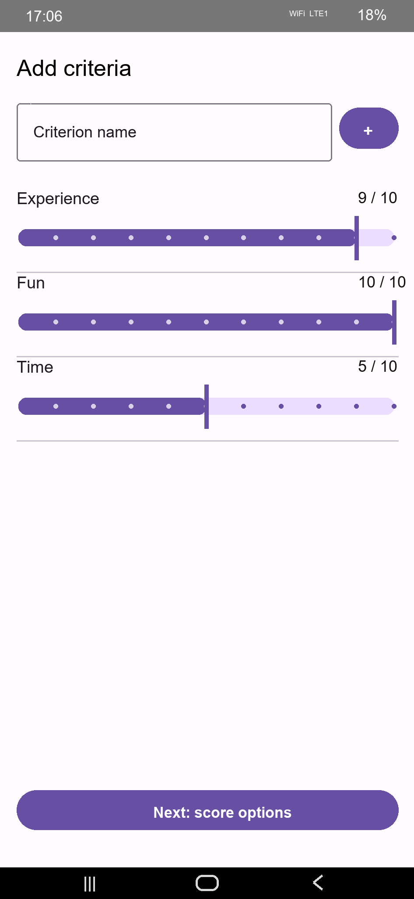
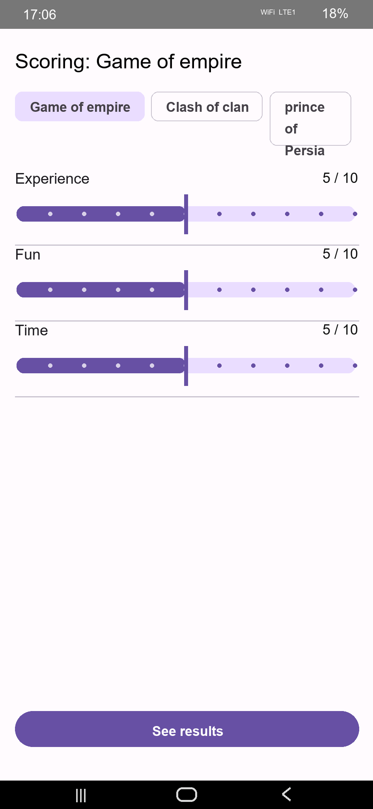
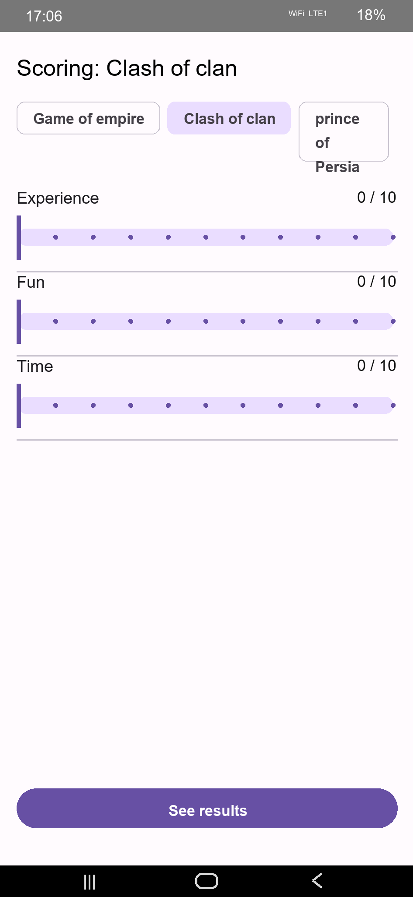
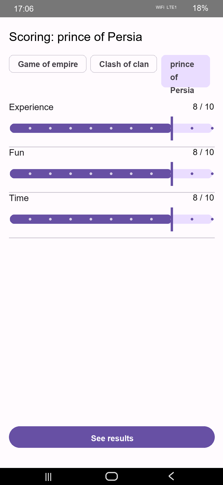
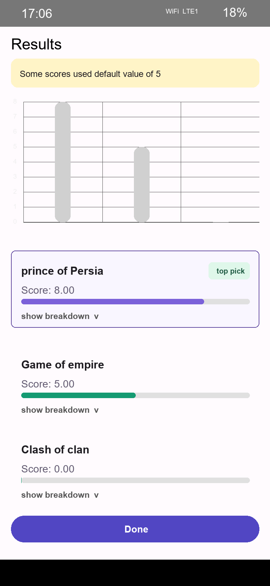

# DecisionMatrix

DecisionMatrix is an Android app that helps users compare multiple options using custom criteria and weighted scores. Instead of guessing the best choice, users can define a decision, add options, score each option against important criteria, and view a ranked result with a clear top pick.

## Summary

This app is useful when a decision has several possible choices and more than one factor matters. For example, you can compare games, purchases, travel plans, project ideas, or any other set of options. DecisionMatrix lets you:

- Create and edit a decision title.
- Add multiple options to compare.
- Add criteria such as fun, time, experience, cost, quality, or priority.
- Score every option from 0 to 10.
- Review calculated results in ranked order.
- See a chart and score breakdown for each option.

## Screenshots

Add the six screenshots to the `screenshots` folder using the filenames shown below.

<table>
  <tr>
    <td align="center">
      <br />
      <b>Edit Decision</b>
    </td>
    <td align="center">
      <br />
      <b>Add Criteria</b>
    </td>
    <td align="center">
      <br />
      <b>Score Option</b>
    </td>
  </tr>
  <tr>
    <td align="center">
      <br />
      <b>Compare Scores</b>
    </td>
    <td align="center">
      <br />
      <b>Score All Options</b>
    </td>
    <td align="center">
      <br />
      <b>Results</b>
    </td>
  </tr>
</table>

## How To Use

1. Open the app and create a new decision.
2. Enter a decision title, such as `Which is the best game I played`.
3. Add the options you want to compare.
4. Add the criteria that matter for the decision.
5. Use the sliders to set the importance or score values from 0 to 10.
6. Score each option against every criterion.
7. Tap `See results` to view the final ranking.
8. Check the top pick, total scores, chart, and optional breakdown.
9. Tap `Done` when you finish reviewing the result.

## Example Flow

In the screenshots, the decision compares three games:

- Game of empire
- Clash of clan
- prince of Persia

The options are scored using criteria such as:

- Experience
- Fun
- Time

After scoring, the app calculates the final result and highlights the highest scoring option as the top pick.

## Features

- Simple decision creation flow
- Editable options
- Custom criteria
- 0 to 10 scoring sliders
- Multiple option scoring screens
- Result ranking
- Top pick label
- Score chart
- Score breakdown support
- Local app data storage

## Tech Stack

- Kotlin
- Android
- Jetpack Compose
- Material 3
- Room Database
- Navigation Compose
- Vico charts

## Project Structure

```text
DecisionMatrix/
+-- app/
|   +-- src/main/java/com/example/decisionmatrix/
|   |   +-- data/
|   |   +-- domain/
|   |   +-- ui/
|   |   +-- MainActivity.kt
|   +-- src/main/res/
+-- gradle/
+-- build.gradle.kts
+-- settings.gradle.kts
+-- README.md
```

## Run The App

1. Open the project in Android Studio.
2. Wait for Gradle sync to finish.
3. Select an emulator or physical Android device.
4. Click `Run`.

You can also build from the terminal:

```bash
./gradlew assembleDebug
```

On Windows:

```powershell
.\gradlew.bat assembleDebug
```

## Requirements

- Android Studio
- Android SDK
- JDK configured for Android development
- Minimum SDK: 24

## Notes

If some option scores are not changed, the app may use a default score value. The results screen displays a warning when default values are used.
